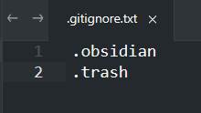
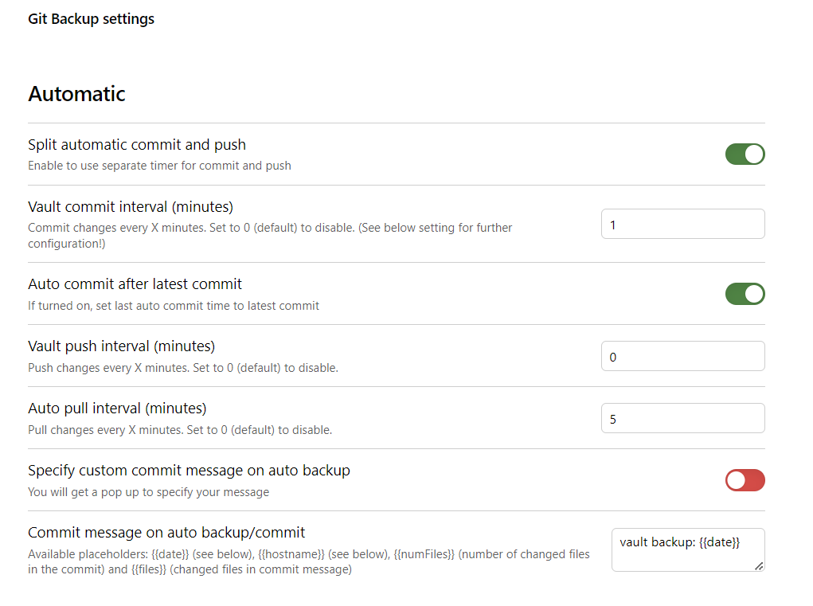

# 插件
1. Git
2. Advanced Tables    `该插件允许用户更方便地创建和编辑复杂的表格`
3. Attachment Name Formatting
4. Calendar  `右上角显示日历`
5. Style Settings(主题可以通过这个调试)
6. Templater
7. Commander  `这个插件提供了一个命令面板，让用户可以快速执行各种命令`
8. Editing Toolbar：`这个插件提供了一个编辑工具栏`

# 主题
1. Atom
2. Minimal
3. Obsidian Nord
4. Blue Topaz
5. Chime

# 使用git+obsidian实现双链笔记（macOS)

✨这是一个学习笔记，包含很多细小基础的点，使用obsidian主要是为以后构建知识星球打基础。如果单纯只是想找一个地方记录知识，推荐有道云笔记。

以下是正文：

分为三部分：git、github、obsidian。

## 一、在本地配置git

#### 1、若本地已安装了git

查看版本号。`git -v`

#### 2、如果本地未安装git

可以通过以下两种方式进行安装。

##### a）使用Homebrew

确保已安装homebrew，如果未安装，直接在终端输入命令：

`/bin/bash -c "$(curl -fsSL https://raw.githubusercontent.com/Homebrew/install/HEAD/install.sh)"`

以上是官方下载，大概率不行。如果失败，请看我基友的文章，讲的很详细。

[mac电脑如何下载homebrew](https://gw-c.nowcoder.com/api/sparta/jump/link?link=https%3A%2F%2Fblog.csdn.net%2Fa3244005396%2Farticle%2Fdetails%2F128068937)

安装成功后，在终端输入以下命令：

`brew install git`

##### b）或者直接在git官网进行下载：[https://git-scm.com/downloads](https://gw-c.nowcoder.com/api/sparta/jump/link?link=https%3A%2F%2Fgit-scm.com%2Fdownloads)

根据提示一步步进行安装。

#### 3、安装完成后，重复1的操作。

git安装和绑定github
1. git安装：
https://blog.csdn.net/mukes/article/details/115693833

2. 绑定github：
在需要上传文件的根目录下，鼠标右键打开git bash，输入以下命令

git config --global user.name "yourname"
git config --global user.email "your@email.com" 

## 二、使用git拉取远程仓库

#### 1、要在GitHub上配置ssh密钥：

在本地拉取github代码时，ssh密钥可以提供更加安全的身份验证机制，一旦配置好ssh密钥，无需每次都输入用户名和密码。所以这个还是很有必要配置一下。

1）生成ssh密钥对：在终端输入

`ssh-keygen -t rsa -C "your_email@example.com"`

引号里是你的github的邮箱

2）将私钥添加到ssh代理，在终端输入：

`cat ~/.ssh/id_rsa.pub`

3）获取公钥：

`cat ~/.ssh/id_rsa.pub`

此时公钥已经在你的剪切板上了。

4）登陆github，点击头像

配置完成后，就可以使用 SSH 协议克隆、推送和拉取 GitHub 上的仓库，无需每次输入用户名和密码。

#### 2.如何在GitHub上建立仓库？

有的同学可能不太清楚如何建立仓库，顺带讲一下。

点击新建，只需要填写三个地方，仓库名，私有还是他人可见，添加一个介绍文件。

#### 3.使用git将远程仓库的代码克隆到本地。

1）打开终端。输入

`ls`

命令ls只list，展示该目录下所有文件和文件夹。

2）输入命令：

`cd 文件夹名`

cd:change directory切换目录

我放Documents里了。

3)获取仓库ssh地址

4）将远程仓库地址拉到本地。

终端输入：

`git clone ssh地址`

 
# Git使用

## 1.去除配置文件

新建一个文本 `.gitignore`  

里面输入如图:

## 2.命令面板快捷键 CTRL + P

1. git Stage ,如果要全部上传,可以直接到第二步选择all change
 

2. git commit staged或者 all changes

3. git push